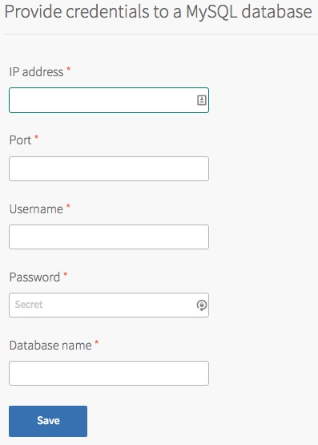
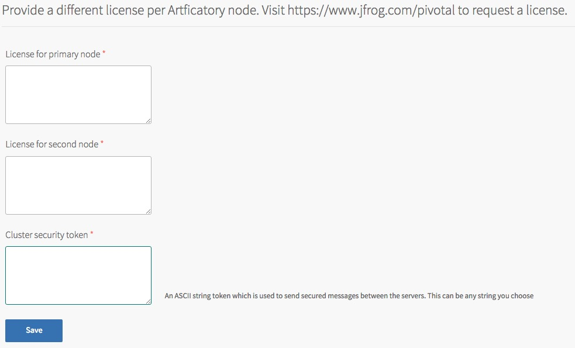

## JFrog Artifactory Configuration

The following properties can be configured for the JFrog Artifactory tile

## MySQL

The product requires an external MySQL database in order to hold its state.

We recommend that you use a MySQL database that is Highly Available to remove any single points of failure from the product.

We have tested using the [MySQL for Pivotal Cloud Foundry&reg;](https://network.pivotal.io/products/p-mysql) tile as well the hosted [ClearDB](https://console.run.pivotal.io/marketplace/cleardb) offering on http://run.pivotal.io.

However any MySQL compatible database should work.

The required fields to be populated are:

* IP Address - this can be a URL or IP address
* DB port
* DB username
* DB password
* Database name

If the database does not exist it will be created upon installation. All database migrations are performed automatically during upgrades of the tile.

## License

You are required to enter a license for each of the two nodes in this Highly Available setup.
The licenses are mandatory and you cannot deploy the tile without them.

The required fields to be populated are:

* Primary node license
* Secondary node license
* Cluster security token - This is an ASCII string token, it can be anything of your choosing

## NFS
The product comes with a built in single node NFS server which will be used as default.

This provides an easy way to get started with the product. The size of the persistent disk can be scaled as you required based on the number of repositories you are hosting.

This is a single node NFS server, so it is a single point of failure in the stack.

### Using an external NFS server
You may wish to use an external NFS server instead of the built in product.
This may be because you have an external solution which is Highly Available or wish to use a hardware product instead of software.

The required fields to be populated are:
* Hostname - can be an IP address or hostname
* Remote path - if not specified it defaults to the root path on the share

